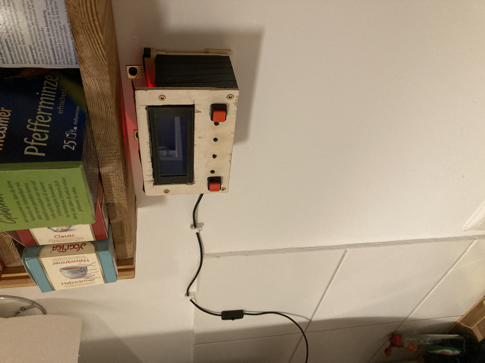
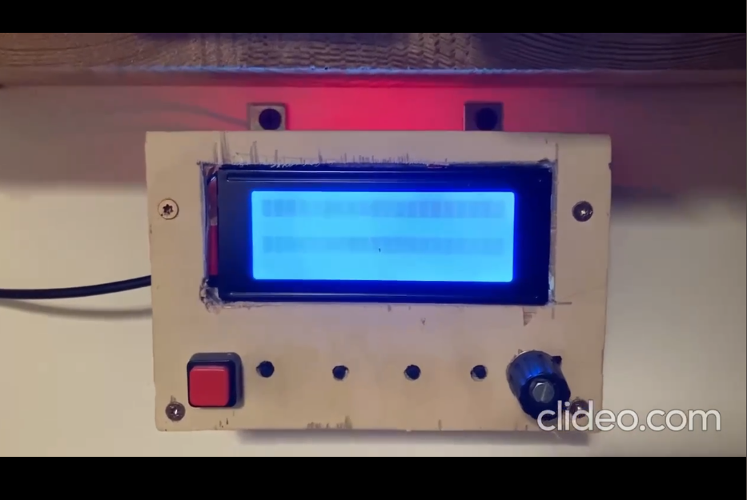

# MQTT-Smarthome-Remote with LCD Display

## ENGLISH VERSION BELOW

> Ein altes Programmierprojekt läuft wunderbar, auch wenn sicherlich einiges am Code nicht optimal ist:)
> Vielleicht dient es dem ein oder anderen Bastler als Inspiration
> Die kleine Einheit  ermöglicht die Musiksteuerung im Smarthome, es zeigt auf dem Display den aktuellen Song der auf Spotify abgespielt wird an.
> Mittels Buttons lässt sich skippen, eine Playlist starten, zum Radio wechseln und mittels Regler die Lautstärke einstellen (das Foto ist nicht aktuell, der rechte Button ist ein Poti).

- Code besteht aus 2 Teilen:
    - einmal dem Projekt für VSC (--> platformio Plugin benutzen), Wifi Credentials hinzufügen und auf ESP spielen
    - einem Python Skript für den Raspberry der dann die via MQTT gesendeten Kommandos verarbeitet und die gewünschten Aktionen im Smarthome ausführt
    - in der main.py ist natürlich für den der es benutzen will außer dem Empfangs/Sendelogik nicht viel nützliches vorhanden, das Programm greift auf meine Musiksteuerung zurück (siehe ggf. zukünfitg  TODO -> Repo)

- in dem lib Ordner befindet sich auch schon einiges an Code für die Realisierung eines Listenmenüs um wirklich die Playlisten-Namen /Songnamen  auf Spotify zu steuern und gezielt auszuwählen, (siehe LinkedMenu), da hatte ich aber nicht mehr weitergemacht

- in dem laufenden Code lässt sich nur per Knopfdruck zwischen 4 zufällig ausgewählten Playlists wählen
  

## English Version

> An old programming project runs wonderfully, even if some of the code is certainly not optimal:)
> Maybe it will serve as inspiration for one or the other hobbyist
> The small unit enables music control in the smart home, it shows the current song being played on Spotify on the display.
> Buttons can be used to skip, start a playlist, switch to the radio and adjust the volume using the controller (the photo is not current, the right button is a potentiometer).

- Code consists of 2 parts:
    - once the project for VSC (--> use platformio plugin), add wifi credentials and play on ESP
    - a Python script for the Raspberry which then processes the commands sent via MQTT and executes the desired actions in the Smarthome
    - in the main.py there is of course not much useful for those who want to use it except the receive/send logic, the programme uses my music control (see possibly future TODO -> Repo)

- in the lib folder there is already some code for the realisation of a list menu to really control and select the playlist names / song names on Spotify, (see LinkedMenu), but I didn't go on with that anymore

- in the running code you can only choose between 4 randomly selected playlists by pressing a button
  

of course, if you read so far you probably want to see it in action. Here you go :)

